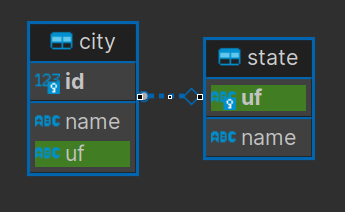

# Script POSTGRESQL - estados e cidades brasileiras.

Script postgresql simples para criar e popular tabelas de estados e cidade brasileiras.

A tabela state possui duas colunas:
- uf - codigo uf como Primary Key
- name - nome completo do estado

A tabela city possui 3 colunas:
- id - inteiro auto incrementado como Primary Key
- name - nome completo da cidade
- uf - codigo uf como Foreign Key (referenciando a tabela state)

<figure>
  
  <figcaption>Diagrama ER</figcaption>
</figure>